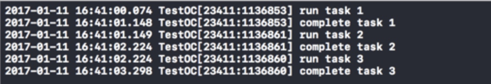
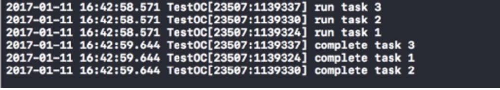

# dispatch_semaphore（信号量）的理解及使用


**dispatch_semaphore（信号量）
括号里面填几 也就是控制最多几个线程去执行任务**

理解这个概念之前，先抛出一个问题

问题描述：

假设现在系统有两个空闲资源可以被利用，但同一时间却有三个线程要进行访问，这种情况下，该如何处理呢？

或者

我们要下载很多图片，并发异步进行，每个下载都会开辟一个新线程，可是我们又担心太多线程肯定cpu吃不消，那么我们这里也可以用信号量控制一下最大开辟线程数。

定义： 

1、信号量：就是一种可用来控制访问资源的数量的标识，设定了一个信号量，在线程访问之前，加上信号量的处理，则可告知系统按照我们指定的信号量数量来执行多个线程。

其实，这有点类似锁机制了，只不过信号量都是系统帮助我们处理了，我们只需要在执行线程之前，设定一个信号量值，并且在使用时，加上信号量处理方法就行了。


2、信号量主要有3个函数，分别是：

```
//创建信号量，参数：信号量的初值，如果小于0则会返回NULL
dispatch_semaphore_create（信号量值）
 
//等待降低信号量
dispatch_semaphore_wait（信号量，等待时间）
 
//提高信号量
dispatch_semaphore_signal(信号量)
```
　　

注意，正常的使用顺序是先降低然后再提高，这两个函数通常成对使用。　（具体可参考下面的代码示例）　


3、那么就开头提的问题，我们用代码来解决


```
-(void)dispatchSignal{
    //crate的value表示，最多几个资源可访问
    dispatch_semaphore_t semaphore = dispatch_semaphore_create(2);   
    dispatch_queue_t quene = dispatch_get_global_queue(DISPATCH_QUEUE_PRIORITY_DEFAULT, 0);
     
    //任务1
    dispatch_async(quene, ^{
        dispatch_semaphore_wait(semaphore, DISPATCH_TIME_FOREVER);
        NSLog(@"run task 1");
        sleep(1);
        NSLog(@"complete task 1");
        dispatch_semaphore_signal(semaphore);       
    });<br>
    //任务2
    dispatch_async(quene, ^{
        dispatch_semaphore_wait(semaphore, DISPATCH_TIME_FOREVER);
        NSLog(@"run task 2");
        sleep(1);
        NSLog(@"complete task 2");
        dispatch_semaphore_signal(semaphore);       
    });<br>
    //任务3
    dispatch_async(quene, ^{
        dispatch_semaphore_wait(semaphore, DISPATCH_TIME_FOREVER);
        NSLog(@"run task 3");
        sleep(1);
        NSLog(@"complete task 3");
        dispatch_semaphore_signal(semaphore);       
    });   
}

```
执行结果：


总结：由于设定的信号值为2，先执行两个线程，等执行完一个，才会继续执行下一个，保证同一时间执行的线程数不超过2。

这里我们扩展一下，假设我们设定信号值=1

dispatch_semaphore_create(1)<br><br>
那么结果就是：




如果设定信号值=3

dispatch_semaphore_create(3)<br><br>
那么结果就是： 



其实设定为3，就是不限制线程执行了，因为一共才只有3个线程。

